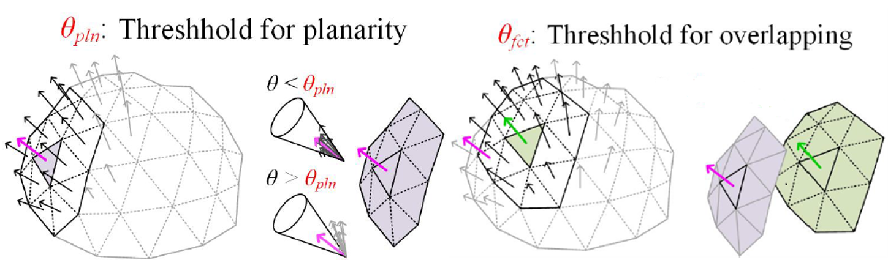
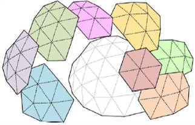
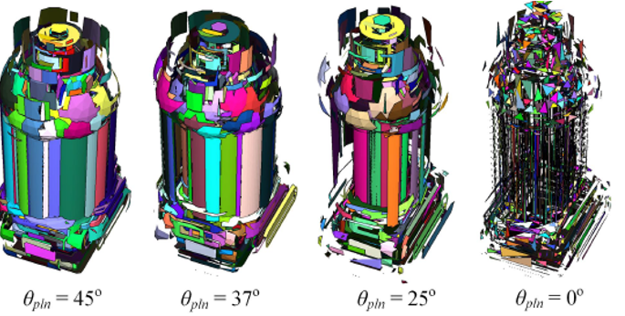
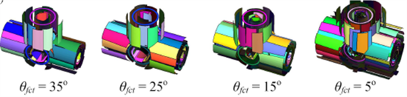
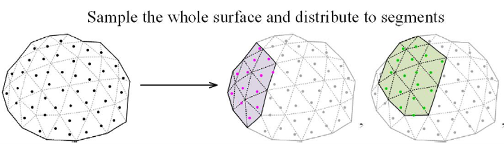

`[](url)`# Planning Grasps for Assembly Tasks


## 1. Overview
   - Description: This project is currently based on the embodiment of the second paper. Data structure and some functions reused from first paper. 
   - Useful Publication:
     1.  https://ieeexplore.ieee.org/abstract/document/9158930     Github: https://github.com/psh117/fgpg.git
     2.  https://ieeexplore.ieee.org/document/9170578      

## 2. Requirements
   - ROS (ros-*-desktop-full version is required)
   - PCL 1.8 or later
   - Eigen 3.0 or later

## 3. Compilation and Execution

The first input is : **configurations** which are loaded using config/options.yaml

The second input is : **stl model** 

```sh
cd ~/Project/src # your ROS workspace
git clone https://gitlab.ipr.kit.edu/uvxgo/planning-grasps-for-assembly-task.git
cd ~/Project
catkin_make

rosrun pgfat pgfat config/options.yaml model.stl  
rosrun pgfat pgfat ~/Project/src/pgfat/config/options.yaml ~/Project/src/pgfat/meshes/Motor_part/Lager.stl
```

## 4. Current work

### Prepocessing to mesh model: Region-Growing


**Procedure:**

1. initiates a seed triangle and scans the surrounding triangles of the seed.  

   the seed is now chosen as the first index of a ordered set to save time.

2. If the angle between the normal of the seed triangle and the normal of a nearby triangle is smaller than the first threshold,

   the adjacent triangle is clustered into the same facet as the seed triangle. 

3. After clustering the first facet, the algorithm initiates a new seed triangle and repeats. 

   the second threshold is not be used now to generate new seed unless I am able to reduce the computational time.

   I currently use a set to contain the index of all the segmented triangles. The new seed is chosen as the first index of the rest unsegmented triangle set.

------

**current problem:** 

I can segment the points now but the computation time is a little bit long. 

Reduce computational time to find neighbouring triangles of the seed triangle. 

**Proposed Result:**



### Random Sampling on facets



**Step 1 : Sampling on each facet.** 

​	the contact points on each facet have equal density and are evenly distributed.

**Step 2 : Removing bad samples:** 

   - near the boundary of facets
   - close to each other

