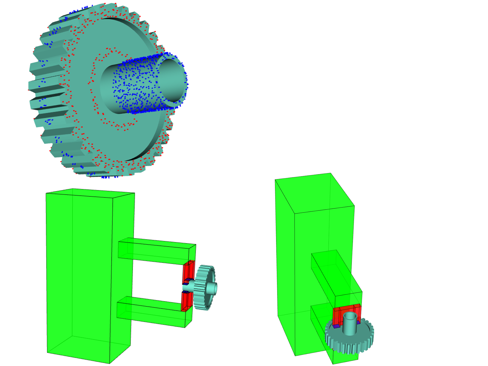
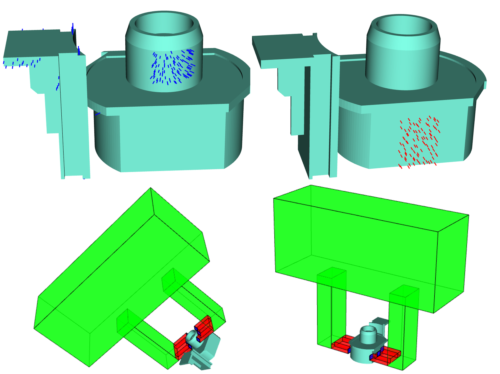

Planning Grasps for Assembly Tasks
====


# 1. Overview
   - Description: This project is currently based on the embodiment of the second paper. Data structure and some functions reused from first paper. 
   - Useful Publication:
     1.  https://ieeexplore.ieee.org/abstract/document/9158930     Github: https://github.com/psh117/fgpg.git
     2.  https://ieeexplore.ieee.org/document/9170578

# 2. Requirements
   - ROS (ros-*-desktop-full version is required)
   - PCL 1.8 or later
   - Eigen 3.0 or later


# 3. Compilation and Execution

**configurations** are wirtten in config/options.yaml

add the object to be analysed to file folder meshes/Motor_part

and then input the object name

```sh
cd ~/Project/src # your ROS workspace
git clone https://gitlab.ipr.kit.edu/uvxgo/planning-grasps-for-assembly-task.git
cd ~/Project
catkin_make

// make sure you have sourced your workspace's setup.sh file after calling catkin_make but before trying to use your applications.
// for example
source /path/to/your/Project/devel/setup.bash

// and then you can run this application
rosrun pgfat pgfat model 
// for example. the object name is Lager.stl in Motor_part folder
rosrun pgfat pgfat Lager  
```

# 4. Current work

## Prepocessing to mesh model: Region-Growing


**Procedure:**

1. initiates a seed triangle and scans the surrounding triangles of the seed.  

   the seed is now chosen as the first index of a ordered set to save time.

2. If the angle between the normal of the seed triangle and the normal of a nearby triangle is smaller than the first threshold,

   the adjacent triangle is clustered into the same facet as the seed triangle. 

3. After clustering the first facet, the algorithm initiates a new seed triangle and repeats. 

   the second threshold is not be used to reduce the computational time.

   I currently use a set to contain the index of all the segmented triangles. The new seed is chosen as the first index of the rest unsegmented triangle set.

------

**current problem:** 
the segmentation can be completed in a reasonable time but it's somehow hard to visualize all the clusters if the number of clusters are large because we are going to render them in the same window (e.g 4000 clusters for mesh model with 20k triangles) 

**Proposed Result in the paper:**


**Result of embodiment:**


## Random Sampling on facets


**Step 1 : Sampling on each facet.** 

​	the contact points on each facet have equal density and are evenly distributed.

**Result of embodiment:**

**points normals on one facet:**


**points normals on all the facets:**


**Step 2 : Removing bad samples:** 

   - remove the sampled points which are too close than each other for every cluster wrt. the tunable parameter Distance_rnn in options.yaml
   

   
## Make Pair for two-finger paraller grippers
**two-finger parallel grippers needs two contact points with opposite contact normals.**

**finds parallel facets and computes candidate contact pairs by examining the contact points on the parallel facets.**

brown ones are the pointed that sampled ramdomly on one facet

red ones are the intersected points of the brown ones


## Planning the grasp configuration

**1. set simplified model for the gripper**

The gripper we used in real application:


The simplified gripper model used for collision check:


**2. finds the possible orientations to attach the parallel gripper to the candidate contact pairs.**

Approach 1: 

Use the distance vector between two points in this point pair as rotation axis.
Decompose 360 degrees into discretized rotation angle wrt. the tunable parameter N_da in options.yaml.
Start with a random vector perpendicular to the normal vector of the point. And Rotate this vector according to the discretized rotation angle.


Approach 2:

find the cluster that grasp point belongs to. And then extract the border edges of the cluster
Set approach direction perpendicular to all the border edges


**3. collision check of the planned grasp poses.**


**stmesh denotes the collision model of a gripper’s stroke**

**eemesh denotes the collision model of a gripper**

**first collision check:  checks if the stroke of the gripper collides with the object**

**second collision check:  checks if the whole hand (both fingers and palm) collides with the object**

**current progress**

The red dot is grasped with four finger faces.

The blue dot is grasped with the groove in the middle of the finger.

And then we compute the contact area for all the possible poses and sort them from large to small.








