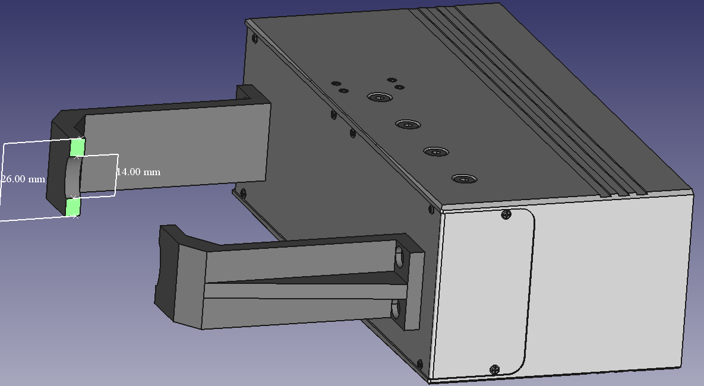

Planning Grasps for Assembly Tasks
====


# 1. Overview
   - Description: This project is currently based on the embodiment of the second paper. Data structure and some functions reused from first paper. 
   - Useful Publication:
     1.  https://ieeexplore.ieee.org/abstract/document/9158930     Github: https://github.com/psh117/fgpg.git
     2.  https://ieeexplore.ieee.org/document/9170578      

# 2. Requirements
   - ROS (ros-*-desktop-full version is required)
   - PCL 1.8 or later
   - Eigen 3.0 or later
   - Bullet

# 3. Compilation and Execution

The first input is : **configurations** which are loaded using config/options.yaml

The second input is : **stl model** 

```sh
cd ~/Project/src # your ROS workspace
git clone https://gitlab.ipr.kit.edu/uvxgo/planning-grasps-for-assembly-task.git
cd ~/Project
catkin_make

rosrun pgfat pgfat config/options.yaml model.stl  
rosrun pgfat pgfat ~/Project/src/pgfat/config/options.yaml ~/Project/src/pgfat/meshes/Motor_part/Lager.stl
```

# 4. Current work

## Prepocessing to mesh model: Region-Growing


**Procedure:**

1. initiates a seed triangle and scans the surrounding triangles of the seed.  

   the seed is now chosen as the first index of a ordered set to save time.

2. If the angle between the normal of the seed triangle and the normal of a nearby triangle is smaller than the first threshold,

   the adjacent triangle is clustered into the same facet as the seed triangle. 

3. After clustering the first facet, the algorithm initiates a new seed triangle and repeats. 

   the second threshold is not be used to reduce the computational time.

   I currently use a set to contain the index of all the segmented triangles. The new seed is chosen as the first index of the rest unsegmented triangle set.

------

**current problem:** 
the segmentation can be completed in a reasonable time, 20K points about 40 seconds.
two many clusters to be rendered in the same window (e.g 4000 clusters for mesh model with 20k triangles) 

**Proposed Result in the paper:**


**Result of embodiment:**


## Random Sampling on facets


**Step 1 : Sampling on each facet.** 

​	the contact points on each facet have equal density and are evenly distributed.

**Result of embodiment:**

**points normals on one facet:**


**points normals on all the facets:**


**Step 2 : Removing bad samples:** 
Whether this part is to be done depends on the results of the evaluation. No need if the result is good enough.
   - near the boundary of facets
   - close to each other
   
## Make Pair for two-finger paraller grippers
**two-finger parallel grippers needs two contact points with opposite contact normals.**

**finds parallel facets and computes candidate contact pairs by examining the contact points on the parallel facets.**


**some results**

brown ones are the pointed that sampled ramdomly on one facet

red ones are the intersected points of the brown ones


## Planning the grasp configuration

**1. finds the possible orientations to attach the parallel gripper to the candidate contact pairs.**

**2. examines the stability of the planned grasps.**


**stmesh denotes the collision model of a gripper’s stroke**

**eemesh denotes the collision model of a gripper**

**first collision check:  checks if the stroke of the gripper collides with the object**

**second collision check:  checks if the whole hand (both fingers and palm) collides with the object**

**current progress**




